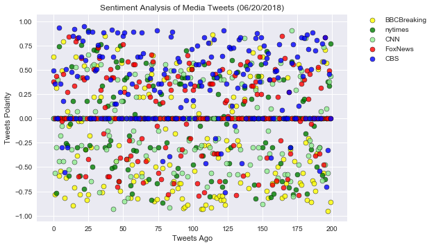
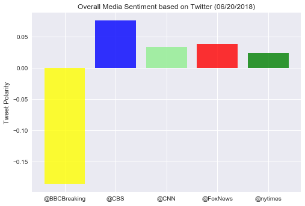

Obeservation 1: All news outlets have a range of positive and negative tweets and average out to a pretty neutral compound score
Obeservation 2: That being said, CBS has the least amount of negative tweets and had the highest compound score
Obeservation 3: BBC has several tweets with a high negative score (close to -1), wich resulted in the lowest compound score


```python
# Dependencies
import tweepy
import numpy as np
from API_KEYS import(
    consumer_key,
    consumer_key_secret,
    access_token,
    access_token_secret
)
from pprint import pprint
import pandas as pd
import matplotlib.pyplot as plt

import os
import csv

# Setup Tweepy API Authentication
auth = tweepy.OAuthHandler(consumer_key, consumer_key_secret)
auth.set_access_token(access_token, access_token_secret)
api = tweepy.API(auth, parser=tweepy.parsers.JSONParser())


# Import and Initialize Sentiment Analyzer
from vaderSentiment.vaderSentiment import SentimentIntensityAnalyzer
analyzer = SentimentIntensityAnalyzer()

```


```python
# Target User Accounts
target_user = ("@BBCBreaking", "@CBS", "@CNN", "@FoxNews", "@nytimes")

# List for dictionaries of results
results_list = []
    
# Variables for info
date_list = [] 
name_list = []
text_list = []
username_list=[]

# Variables for holding sentiments
compound_list = []
positive_list = []
negative_list = []
neutral_list = []


# Loop through each user
for user in target_user:

    # Loop through 10 pages of tweets (total 100 tweets)
    for x in range(1, 11):
               
        # Get all tweets from home feed
        public_tweets = api.user_timeline(user, page=x)

        # Loop through all tweets
        for tweet in public_tweets:
            
            
            # Add each value to the appropriate list
            date_list.append(tweet['created_at'])
            name_list.append(tweet['user']['name'])
            text_list.append(tweet['text'])
            username_list.append(tweet['user']['screen_name'])
            
            # Run Vader Analysis on each tweet
            results = analyzer.polarity_scores(tweet["text"])
            compound = results["compound"]
            pos = results["pos"]
            neu = results["neu"]
            neg = results["neg"]

            # Add each value of Vader Analysis to the appropriate list
            compound_list.append(compound)
            positive_list.append(pos)
            negative_list.append(neg)
            neutral_list.append(neu)

    
     # Create a dictionaty to hold averages
    mean_user_results = {
        "Username": user,
        "Compound Score": np.mean(compound_list),
        "Postive Score": np.mean(positive_list),
        "Neutral Score": np.mean(neutral_list),
        "Negative Score": np.mean(negative_list)
    }

    # Append dictionary to list
    results_list.append(mean_user_results)

    # Print the Averages
#     print(f"User: {user}")
#     print(f"Compound: {np.mean(compound_list):.3f}")
#     print(f"Positive: {np.mean(positive_list):.3f}")
#     print(f"Neutral: {np.mean(neutral_list):.3f}")
#     print(f"Negative: {np.mean(negative_list):.3f}")
    

# Create a dictionaty of results
user_results = {
   "Date": date_list,
   "Name": name_list,
   "Text": text_list,
   "username":username_list,
   "positive":positive_list,
   "negative":negative_list,
   "neutral":neutral_list,
   "compound":compound_list
    }
    
```


```python
# Create DataFrame from Results List
results_df = pd.DataFrame(user_results)

# change index to username so we can create dataframe for each news outlet
results_df=results_df.set_index("username")

##BBC. Reset index twice so we can use this as count
results_df_BBC=results_df.loc["BBCBreaking"]
results_df_BBC.reset_index(level=0, inplace=True)
results_df_BBC.reset_index(level=0, inplace=True)
results_df_BBC

##NYT
results_df_NYT=results_df.loc["nytimes"]
results_df_NYT.reset_index(level=0, inplace=True)
results_df_NYT.reset_index(level=0, inplace=True)
results_df_NYT

##CNN
results_df_CNN=results_df.loc["CNN"]
results_df_CNN.reset_index(level=0, inplace=True)
results_df_CNN.reset_index(level=0, inplace=True)
results_df_CNN

##CBS
results_df_CBS=results_df.loc["CBS"]
results_df_CBS.reset_index(level=0, inplace=True)
results_df_CBS.reset_index(level=0, inplace=True)
results_df_CBS

##Fox
results_df_Fox=results_df.loc["FoxNews"]
results_df_Fox.reset_index(level=0, inplace=True)
results_df_Fox.reset_index(level=0, inplace=True)

results_df.head()

```


<div>
<style scoped>
    .dataframe tbody tr th:only-of-type {
        vertical-align: middle;
    }

    .dataframe tbody tr th {
        vertical-align: top;
    }

    .dataframe thead th {
        text-align: right;
    }
</style>
<table border="1" class="dataframe">
  <thead>
    <tr style="text-align: right;">
      <th></th>
      <th>Date</th>
      <th>Name</th>
      <th>Text</th>
      <th>compound</th>
      <th>negative</th>
      <th>neutral</th>
      <th>positive</th>
    </tr>
    <tr>
      <th>username</th>
      <th></th>
      <th></th>
      <th></th>
      <th></th>
      <th></th>
      <th></th>
      <th></th>
    </tr>
  </thead>
  <tbody>
    <tr>
      <th>BBCBreaking</th>
      <td>Thu Jun 21 16:33:54 +0000 2018</td>
      <td>BBC Breaking News</td>
      <td>I would like to ask how I can help reunite the...</td>
      <td>0.6369</td>
      <td>0.000</td>
      <td>0.776</td>
      <td>0.224</td>
    </tr>
    <tr>
      <th>BBCBreaking</th>
      <td>Thu Jun 21 13:03:15 +0000 2018</td>
      <td>BBC Breaking News</td>
      <td>US police arrest a 22-year-old man over killin...</td>
      <td>-0.7783</td>
      <td>0.343</td>
      <td>0.657</td>
      <td>0.000</td>
    </tr>
    <tr>
      <th>BBCBreaking</th>
      <td>Thu Jun 21 10:48:17 +0000 2018</td>
      <td>BBC Breaking News</td>
      <td>Trade minister Greg Hands to quit UK governmen...</td>
      <td>0.3182</td>
      <td>0.000</td>
      <td>0.859</td>
      <td>0.141</td>
    </tr>
    <tr>
      <th>BBCBreaking</th>
      <td>Thu Jun 21 06:29:27 +0000 2018</td>
      <td>BBC Breaking News</td>
      <td>It's a girl: New Zealand’s PM Jacinda Ardern b...</td>
      <td>0.0000</td>
      <td>0.000</td>
      <td>1.000</td>
      <td>0.000</td>
    </tr>
    <tr>
      <th>BBCBreaking</th>
      <td>Wed Jun 20 19:20:55 +0000 2018</td>
      <td>BBC Breaking News</td>
      <td>President Trump signs order aiming to end immi...</td>
      <td>-0.5859</td>
      <td>0.192</td>
      <td>0.808</td>
      <td>0.000</td>
    </tr>
  </tbody>
</table>
</div>


```python
# Export to csv
output_path = os.path.join('Output', 'tweetinfo.csv')
results_df.to_csv(output_path, index=False, header=True)
```


```python
# Plot the scatter graph
plt.title("Sentiment Analysis of Media Tweets (06/20/2018)")
plt.xlabel("Tweets Ago")
plt.ylabel("Tweets Polarity")

# one scatter plot for each news outlet

scatter1=plt.scatter(results_df_BBC["index"],results_df_BBC["compound"], marker="o",c= "yellow",
                     alpha=0.8, label="BBCBreaking",edgecolor="black",linewidths=0.5)

scatter2=plt.scatter(results_df_NYT["index"],results_df_NYT["compound"], marker="o",c= "green",
                     alpha=0.8, label="nytimes",edgecolor="black",linewidths=0.5)

scatter3=plt.scatter(results_df_CNN["index"],results_df_CNN["compound"], marker="o",c= "lightgreen",
                     alpha=0.8, label="CNN",edgecolor="black",linewidths=0.5)

scatter4=plt.scatter(results_df_Fox["index"],results_df_Fox["compound"], marker="o",c= "red",
                     alpha=0.8, label="FoxNews",edgecolor="black",linewidths=0.5)

scatter5=plt.scatter(results_df_CBS["index"],results_df_CBS["compound"], marker="o",c= "blue",
                     alpha=0.8, label="CBS",edgecolor="black",linewidths=0.5)

## create Legend and place outside of graph
plt.legend(bbox_to_anchor=(1.05, 1), loc=2, borderaxespad=0.)

# Customize the grid
plt.style.use('seaborn')

## save plot as image
plt.savefig("./Images/SentimentAnalysis.png")
```





```python
# Create DataFrame pf averages
results_mean_df = pd.DataFrame(results_list).round(3)
results_mean_df

```


<div>
<style scoped>
    .dataframe tbody tr th:only-of-type {
        vertical-align: middle;
    }

    .dataframe tbody tr th {
        vertical-align: top;
    }

    .dataframe thead th {
        text-align: right;
    }
</style>
<table border="1" class="dataframe">
  <thead>
    <tr style="text-align: right;">
      <th></th>
      <th>Compound Score</th>
      <th>Negative Score</th>
      <th>Neutral Score</th>
      <th>Postive Score</th>
      <th>Username</th>
    </tr>
  </thead>
  <tbody>
    <tr>
      <th>0</th>
      <td>-0.186</td>
      <td>0.134</td>
      <td>0.810</td>
      <td>0.056</td>
      <td>@BBCBreaking</td>
    </tr>
    <tr>
      <th>1</th>
      <td>0.076</td>
      <td>0.078</td>
      <td>0.807</td>
      <td>0.115</td>
      <td>@CBS</td>
    </tr>
    <tr>
      <th>2</th>
      <td>0.034</td>
      <td>0.076</td>
      <td>0.829</td>
      <td>0.095</td>
      <td>@CNN</td>
    </tr>
    <tr>
      <th>3</th>
      <td>0.039</td>
      <td>0.074</td>
      <td>0.834</td>
      <td>0.092</td>
      <td>@FoxNews</td>
    </tr>
    <tr>
      <th>4</th>
      <td>0.024</td>
      <td>0.073</td>
      <td>0.843</td>
      <td>0.084</td>
      <td>@nytimes</td>
    </tr>
  </tbody>
</table>
</div>


```python
## plot results as Bar Chart
compound = results_mean_df["Compound Score"]
labels = results_mean_df["Username"]
x_axis = np.arange(len(labels))
colors = ["yellow", "blue", "lightgreen", "red","green"]


plt.bar(x_axis, compound , color=colors, alpha=0.8,
        tick_label=labels)

plt.title("Overall Media Sentiment based on Twitter (06/20/2018)")
plt.ylabel("Tweet Polarity")

# Customize the grid
plt.style.use('seaborn')

plt.savefig("./Images/MediaSentiment.png")
```




